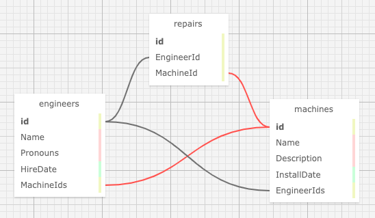

# Dr. Sillystringz's Factory

#### By E. Luckie ☀️

#### An application for a faux factory to keep track of their machine repairs.

## Technologies Used

* C#
* .NET 7.0
* EF Core 7.0
* MySQL Workbench
* HTML
* Markdown
* Git

## Description
An MVC web application to manage a factory's engineers and the machines they are licensed to fix. The factory manager is able to add a list of engineers, a list of machines, and specify which engineers are licensed to repair which machines.

### Paths
**/** Home page welcoming user to Dr. Sillystringz's. Contains an overview list of current engineers & current machines. Also has links to manage or add engineers, and manage or add machines

**/Engineers** Engineers main page showing full list of current engineers and their pronouns

**/Machines** Machines main page showing full list of current machines and their respective engineers

**/{Engineers or Machines}/Create** A form to add a new machine or engineer (depending on which link was clicked)

**/Engineers/Details/{id}** A page that displays the selected engineer's name, pronouns, hire date, and any current machine ceritifications. Includes links to add a new machine to this engineer, edit this engineer, delete this engineer, return back to the full list of engineers, see the full list of machines, or return to the home page. Also includes a clickable button to un-certify engineer from any specific machine

**/{Engineers or Machines}/Edit/{id}** A form to edit the current machine or engineer (depending on which link was clicked). Both forms include links that say _NVM NVM NVM_ and take the user back to the selected detail pages, and links to instead manage the machines or engineers, or go back to the main page

**/{Engineers or Machines}/Delete/{id}** A page confirming you'd like to delete the selected engineer or machine. Clicking the button officially deletes them, and re-routes the user back to the respective main pages displaying the full list of engineers or machines. If user clicks the _NVM NVM NVM_ link instead of the button, the selected machine or engineer is not deleted, and the user is re-routed back to the selected's details page

**/Machines/Details/{id}** A page that displays the selected machine's name, description, install date, and any technicians certified for that machine. From there, the user is also able to choose to edit or delete the selected machine, as well as add some new engineers to be certified

**/Machines/AddEngineer/{id}** A page that displays the selected machine's name and a drop down list of current engineers. The user is able to select one engineer from the list at a time to _Make it official_ which will certify the selected engineer and re-route to the selected machine's details page, showing the updated list of certified engineers

## Setup/Installation Requirements

1. Clone this repository
2. Open your terminal (e.g., Terminal or GitBash) and navigate to this project's production directory called _**Factory**_.
3. In the command line, run the command ``dotnet restore`` to restore the necessary packages for the application to run
4. Within the production level of this directory, called _**Factory**_, create a new file called **appsettings.json**
5. Input the following code into your _**appsettings.json**_ file

* Replace _[ YOUR-DB-NAME ]_ with the name you would like for the database that you will be utilizing via MySQL Workbench
* Replace _[ YOUR-USER-HERE ]_ with your username for MySQL Workbench
* Replace _[ YOUR-PASSWORD-HERE ]_ with your password for MySQL Workbench
* Make sure you save the changes you've made to the file
* If you are planning on pushing your work back to GitHub to a new repository, _make sure to commit your .gitignore file first so that your sensitive information is kept private_

### Viewing the Active Project
6. In your computer's terminal, navigate to the production level of this directory called _**Factory**_
7. In the command line, run the command ``dotnet ef database update``
* This will create a new database for the project in MySQL Workbench named as you specified in the _appsettings.json_ file.
* You may choose to verify that the new database and related tables were created accurated in MySQL Workbench by clicking the small refresh button in the top right corner of the _Schemas_ tab. Your new database name should appear on the list and you should be able to click on it to view/alter the relevant tables
8. In the command line, run the command ``dotnet watch run`` to compile and execute the webpage in Development mode
* Optionally, you can run the command ``dotnet build`` to compile the program without running it

### Schemas

## Known Bugs

* No known bugs.

## Stretch Plans

* Add properties to specify if a machine is operational, malfunctioning, or in the process of being repaired
* Add properties to specify if an engineer is idle or actively working on repairs
* Add inspection dates to the machines, or dates of license renewal to the engineers
* Add a table for incidents, showing which engineer repaired which machine
* Add a table for locations, and specify which engineers or machines are located at which factory
* Add styling

## License

MIT License

Copyright (c) 2023 Luckie